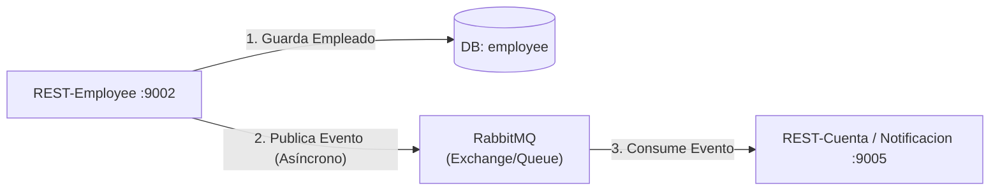

# Diseño Arquitectónico: Creación de Empleado y Eventos Asíncronos con RabbitMQ

Para modernizar la comunicación y hacerla más resiliente, vamos a modificar el flujo para que **después de crear un empleado** en la base de datos, se envíe un evento asíncrono a través de `RabbitMQ` en lugar de usar llamadas síncronas directas (como Feign Client).

Este enfoque es ideal para notificar a otros servicios (por ejemplo, para enviar un correo de bienvenida o crearle una cuenta bancaria/usuario de forma automática) sin que el usuario tenga que esperar a que esos otros procesos terminen.

## Nuevo Flujo Propuesto (Arquitectura Orientada a Eventos)



1. **Síncrono (Local):** `REST-Employee` recibe el POST HTTP y guarda al nuevo empleado en su propia base de datos (como se visualizó en los logs de Hibernate).
2. **Asíncrono (Nuevo):** Justo después de guardarlo con éxito, `REST-Employee` publica un mensaje en RabbitMQ (ej. "Empleado Creado: ID 3, Email jp@gmail.com").
3. **Procesamiento de Fondo:** Otros servicios (como un `Notificacion-Service` o `REST-Cuenta`) escuchan la cola de RabbitMQ, toman el evento y actúan de forma totalmente asíncrona.

> [!TIP]
> Al usar este enfoque asíncrono, si el servicio de Notificaciones está caído en el momento en que se crea el Empleado, el mensaje se quedará encolado de forma segura en RabbitMQ y se procesará automáticamente cuando el servicio vuelva a levantar. El usuario nunca notará la caída.

---

## Pasos Detallados para la Implementación (Manual)

Como solicitaste **no hacer ningún cambio en el código**, aquí te detallo exactamente lo que debes adaptar en tu código para cumplir con este nuevo diseño.

### PASO 1: Modificar `REST-Employee` (El Productor)

1. **Agregar Dependencia en `pom.xml` de `REST-Employee`:**
   ```xml
   <dependency>
       <groupId>org.springframework.boot</groupId>
       <artifactId>spring-boot-starter-amqp</artifactId>
   </dependency>
   ```

2. **Añadir configuración en `application.yaml`:**
   ```yaml
   spring:
     rabbitmq:
       host: localhost
       port: 5672
       username: guest
       password: guest
   ```

3. **Crear Configuración de RabbitMQ en `REST-Employee`:**
   Crea una clase `RabbitMQConfig` para definir el intercambio (exchange) y el enrutamiento.
   ```java
   import org.springframework.amqp.core.*;
   import org.springframework.context.annotation.Bean;
   import org.springframework.context.annotation.Configuration;

   @Configuration
   public class RabbitMQConfig {
       public static final String EXCHANGE = "empleado.exchange";
       public static final String ROUTING_KEY = "empleado.routingKey";
       // No declaramos la Queue aquí (usualmente la declara el consumidor) 
       // pero sí el Exchange al cual enviaremos.
       
       @Bean
       public TopicExchange exchange() { 
           return new TopicExchange(EXCHANGE); 
       }
   }
   ```

4. **Publicar el mensaje en el controlador/servicio al crear el Empleado:**
   Modifica tu lógica de negocio (por ejemplo en `EmployeeService` o directamente donde llamas al `save` de JPA) e inyecta el `RabbitTemplate` para emitir el evento.
   ```java
   import org.springframework.amqp.rabbit.core.RabbitTemplate;
   import org.springframework.stereotype.Service;
   // ...

   @Service
   public class EmployeeService {
       
       @Autowired
       private EmployeeRepository employeeRepository;

       @Autowired
       private RabbitTemplate rabbitTemplate;

       public Employee crearEmpleado(Employee empleado) {
           // 1. Guarda en Base de Datos de manera normal
           Employee empleadoGuardado = employeeRepository.save(empleado);
           
           // 2. Envío de evento a RabbitMQ de manera asíncrona
           String mensaje = "Nuevo empleado creado con ID: " + empleadoGuardado.getId() 
                            + " y Correo: " + empleadoGuardado.getEmail_Empl();
           
           rabbitTemplate.convertAndSend(
               RabbitMQConfig.EXCHANGE, 
               RabbitMQConfig.ROUTING_KEY, 
               mensaje
           );
           
           // El usuario obtiene su respuesta inmediata, no se bloquea por otros servicios
           return empleadoGuardado;
       }
   }
   ```

### PASO 2: Configurar los Consumidores (`Notificacion-Service` o `REST-Cuenta`)

En el/los microservicios que necesiten enterarse de que se creó un empleado, debes agregar la dependencia de AMQP (`spring-boot-starter-amqp`), configurar la conexión a RabbitMQ en el `application.yaml` (igual que en el paso 1.2) y definir un método que consuma la cola:

```java
import org.springframework.amqp.rabbit.annotation.Exchange;
import org.springframework.amqp.rabbit.annotation.Queue;
import org.springframework.amqp.rabbit.annotation.QueueBinding;
import org.springframework.amqp.rabbit.annotation.RabbitListener;
import org.springframework.stereotype.Component;

@Component
public class EmpleadoCreadoListener {

    // Configura dinámicamente la cola y su bindeo al exchange del Productor
    @RabbitListener(bindings = @QueueBinding(
            value = @Queue(value = "notificacion.empleado.queue", durable = "true"),
            exchange = @Exchange(value = "empleado.exchange", type = "topic"),
            key = "empleado.routingKey"
    ))
    public void recibirMensajeEmpleadoCreado(String mensaje) {
        System.out.println("EVENTO RECIBIDO -> " + mensaje);
        // Aquí iría la lógica para enviar el correo de bienvenida
        // O crear la cuenta del banco usando la información recibida.
    }
}
```

> [!IMPORTANT]
> - Asegúrate de que el contenedor Docker (o tu servidor local) de RabbitMQ esté ejecutándose antes de probar el Endpoint de Employee.
> - Si necesitas enviar un objeto complejo (como un JSON de la clase Empleado en lugar de un String), asegúrate de configurar un `MessageConverter` como `Jackson2JsonMessageConverter` en la configuración de RabbitMQ en ambos servicios.
